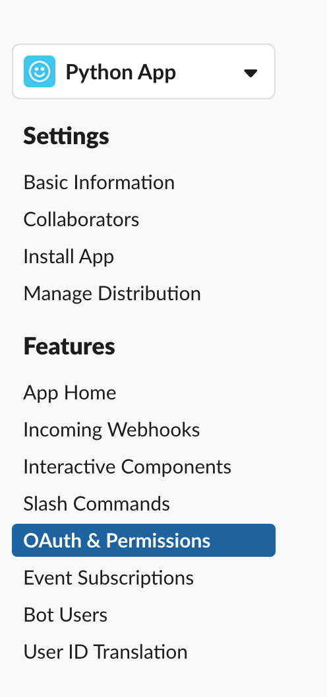
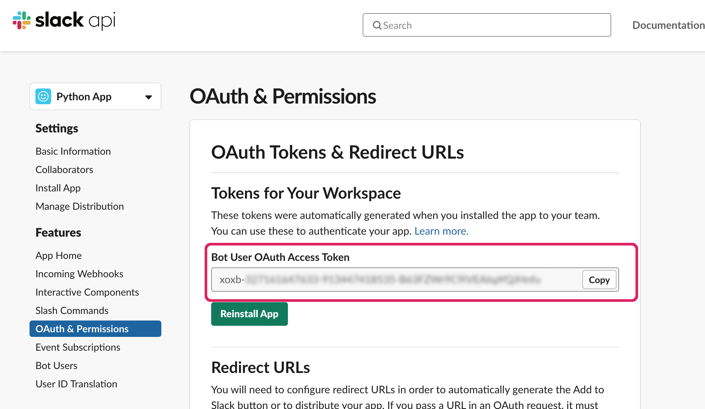

# Create a Slack app

> 💡 Build useful apps, internal tools, simplified workflows, or brilliant bots for just your team or Slack's millions of users.

- To get started, create a new Slack App on [api.slack.com](https://api.slack.com/apps?new_granular_bot_app=1).
  1. Type in your app name.
  2. Select the workspace you'd like to build your app on - the NewsApps slack!
  3. Post in the NewsApps #slack-bots channel the name of your app - I'll need to add it.

### Give your app permissions

[Scopes](https://api.slack.com/scopes) give your app permission to do things (for example, post messages) in your development workspace.

- Navigate to **OAuth & Permissions** on the sidebar to add scopes to your app

- Scroll down to the **Bot Token Scopes** section and click **Add an OAuth Scope**.

For now, we'll only use two scopes.

- Add the [`chat:write` scope](https://api.slack.com/scopes/chat:write) to grant your app the permission to post messages in channels it's a member of.
- Add the [`im:write` scope](https://api.slack.com/scopes/im:write) to grant your app the permission to post messages in DMs.

🎉 You should briefly see a success banner.

_If you want to change your bot user's name, click on **App Home** in the left sidebar and modify the display name._

### Install the app in your workspace

- Click on "Install App" under Settings on the top left.

🏁 Finally copy and save your bot token. You'll need this to communicate with Slack's Platform.

Go to your repository in GitHub, click on "Settings", then on the left click on "Secrets and Variables" under the "Security" section.

Click on "Codespaces" and then add a new repository secret using the green button:.

Call your new secret `SLACK_API_TOKEN` and paste in the value you copied from above.
---

If your codespace is already open, you will need to reload it for it to recognize your token.

**Next section: [02 - Building a message](02-building-a-message.md).**
